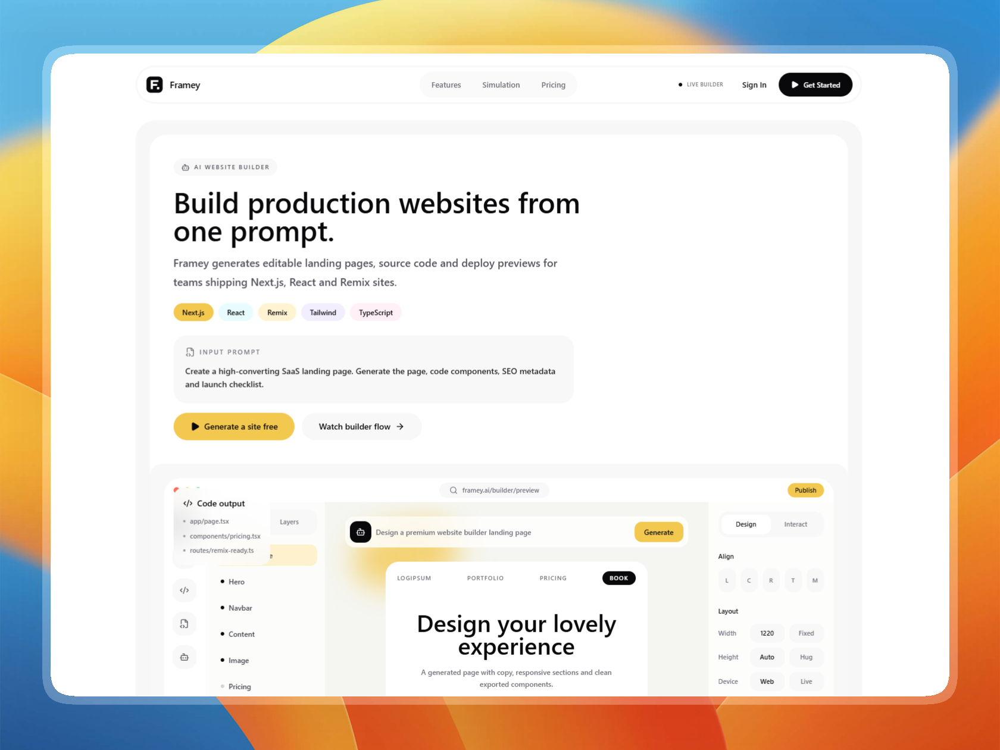

# 🚀 Framey Landing Page

> **Day 3/30 of the "Building 1 AI-Generated Landing Page Every Day" Challenge**



## 🚀 About

Conceptual landing page for **Framey**, a **world-class AI website builder for production landing pages**, developed with **Next.js 16** and **Tailwind CSS 4**. This project is the third realization of an ambitious challenge: creating **1 complete and functional mockup per day using AI**.

Framey is designed for teams who want to move from a simple product brief to a polished, editable, and exportable website. It simulates an AI builder that generates landing page structure, responsive sections, brand tokens, source files, preview states, and production handoff for modern stacks like **Next.js**, **React**, and **Remix**.

## 🎨 Design & Aesthetic Decisions (The "Why")

For this third day, the challenge was to create a **clean, light, bento-driven, and product-led** interface inspired by modern AI builder tools.

- **Light Bento System:** The page uses large, well-defined containers, modular cards, and structured dashboard mockups to make the product feel tangible and professional.
- **No Gradients, No Heavy Shadows:** The visual direction relies on soft neutral backgrounds, clean spacing, subtle inset treatments, and restrained color accents instead of decorative effects.
- **AI Builder Simulation:** The hero and feature sections focus on realistic builder states: prompt workspace, generated page map, code package, responsive states, export checks, and editable preview panels.
- **Smooth Motion:** Subtle `motion/react` interactions support the product narrative without overwhelming the layout.
- **Premium Typography:** Leveraging _Inter_ to keep the landing page sharp, readable, and aligned with serious product teams.

## 🧩 Key Sections

- **🌟 Product-Led Hero:** A clear top-and-bottom hero with a prompt brief, stack tags, primary CTAs, and a detailed AI website builder dashboard mockup.
- **🏗️ Generation Network:** A proof section showing launch metrics, brand movement, live generation status, and product readiness signals.
- **🧠 Creation Engine:** A bento feature system showing the prompt workspace, generated page map, brand tokens, responsive states, deploy preview, framework export, and QA handoff.
- **🔄 Builder Workflow:** A step-by-step process from prompt to generated pages, exportable code, and publish-ready iteration.
- **💬 Customer Proof:** White testimonial cards with Cosmos-inspired sliding motion, clean profile details, and production-focused feedback.
- **💳 Pricing Bento:** Structured pricing cards for solo builders and teams, paired with export ownership and launch features.
- **❓ Production FAQ:** A readable FAQ system explaining code export, supported frameworks, team editing, and production readiness.
- **🚀 Final CTA & Footer:** A modern closing section with brief inbox, export summary, contact actions, and product navigation.

## 🛠️ Tech Stack

This mockup was built with cutting-edge technologies:

- **[Next.js 16](https://nextjs.org/)** (App Router)
- **[React 19](https://react.dev/)**
- **[Tailwind CSS v4](https://tailwindcss.com/)** for ultra-fast utility styling.
- **[Motion](https://motion.dev/)** for smooth reveal transitions and interactive states.
- **[Lucide React](https://lucide.dev/)** for consistent, minimalist iconography.
- **[pnpm](https://pnpm.io/)** for fast, disk-efficient package management.

## 🚀 Quick Start

```bash
# Install dependencies
pnpm install

# Run development server
pnpm dev
```

Open [http://localhost:3000](http://localhost:3000) in your browser to see the result.

## 🌌 Let's meet in space (or on Earth) 🚀

I'm always happy to discuss new projects, collaborations, or simply exchange creative ideas. Here's how to contact me:

- **📧 Email**: [hello@adrielzimbril.com](mailto:hello@adrielzimbril.com)
- **🌐 Website**: [https://www.adrielzimbril.com](https://www.adrielzimbril.com)
- **🐦 Twitter**: [https://twitter.com/adrielzimbril](https://twitter.com/adrielzimbril)
- **💼 LinkedIn**: [https://www.linkedin.com/in/adrielzimbrilcode](https://www.linkedin.com/in/adrielzimbrilcode)
- **🐼 GitHub**: [https://github.com/adrielzimbril](https://github.com/adrielzimbril)

### 🐼 Fun Facts

- 🚀 Passionate about AI and Generative Art
- 🐼 Love pandas (and animals in general!)
- 🎨 Creative at heart, whether in design or code
- ☕ Addicted to coffee and complex technical challenges

## 📄 License

This project is under the MIT license. Feel free to use it as a base for your own projects.

---

**Developed with ❤️ by Adriel Zimbril**  
_Product Designer & Fullstack Developer_  
🚀 Digital Universe Explorer | 🐼 Panda Friend | 🎨 Passionate Creator
